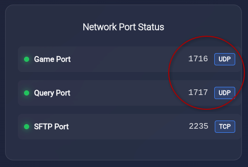

# Setting Up AA2Reborn with CubeCoders AMP

[CubeCoders AMP](https://cubecoders.com/AMP) is a web-based game server management panel. This guide walks you through getting an AA2Reborn server running using the community AMP template.

::: warning Linux Only
The AA2Reborn AMP template is **Linux only**. AMP must be configured to use Docker — the template runs the server binaries via Wine inside the `cubecoders/ampbase:wine-stable` Docker image.
:::

## Before You Start

You'll need:

- AMP installed on a Linux host with Docker or Podman enabled
- A **Server Secret** from [tracker.aa2reborn.com](https://tracker.aa2reborn.com) — log in, go to your profile, and create a server entry to get one
- Your server's **public IP address** — find it at [ipinfo.io/ip](https://ipinfo.io/ip)
- Ports **1716/UDP** (game) and **1717/UDP** (query) open in your firewall and forwarded if you're behind a router

## Step 1 — Add the Template Repository

The AA2Reborn template isn't built into AMP — you need to add it first.

In your AMP panel, go to:

**ADS → Configuration → Instance Deployment → Configuration Repositories**

Add the following repository:

```
demorgon989/AMPTemplates:main
```

Click **Fetch**, then do a hard refresh (`Ctrl+Shift+R`).

::: tip
If the templates don't show up in the next step, click **Fetch** once more and refresh again.
:::

## Step 2 — Create an Instance

Go to **Create Instance** and select **AA2Reborn** from the game dropdown. Make sure you're creating a **Generic Module** instance with Docker.

AMP will download the server files from the AA2Reborn CDN on first start — this may take a few minutes.

## Step 3 — Configure Required Settings

Open the instance and go to the **Configuration** tab. At minimum you need to fill in these three fields under **AA2Reborn Auth**:

| Setting | Where to get it |
|---|---|
| **Server Secret** | Your profile on [tracker.aa2reborn.com](https://tracker.aa2reborn.com) |
| **External IP** | [ipinfo.io/ip](https://ipinfo.io/ip) |
| **Auth Port** | Must match your Game Port (default: `1716`) |

Without these, your server will start but won't appear on the public list.

You'll probably also want to set your **Server Name** under **Server Settings** before going live.

## Step 4 — Start the Server

Hit **Start** on the instance page. Check the **Console** tab for live output — if something goes wrong on startup it will show there.

Once running, your server should appear in the AA2Reborn server browser within a minute or two.

## Ports Reference

| Port | Protocol | Purpose |
|---|---|---|
| `1716` | UDP | Game port |
| `1717` | UDP | Query port |

The query port is always game port + 1. Both must be open and forwarded.

## Troubleshooting

**Server doesn't appear on the public list**
- Double-check your **Server Secret**, **External IP**, and that **Auth Port** matches **Game Port**
- Make sure ports 1716 and 1717 are open and forwarded in your host firewall and router
AMP automatically assigns available ports at instance creation — these may not be 1716/1717. Check the ports AMP assigned by looking at the AA2Reborn dashboard in AMP, then make sure your Game Port and Auth Port in the configuration match what AMP has assigned. It's easier to update the config to match AMP than the other way around.

::: details Screenshot — Network and Ports tab

:::

**Instance fails to start**
- Check the AMP **Console** tab for error output
- Confirm Docker is properly configured and AMP has internet access for the initial file download

**Template doesn't appear in Create Instance**
- Return to **Configuration Repositories**, click **Fetch**, and hard refresh

---

For a full breakdown of every configuration option — including Ultimate Mod settings — see the [AMP Configuration Reference](./amp-configuration).
