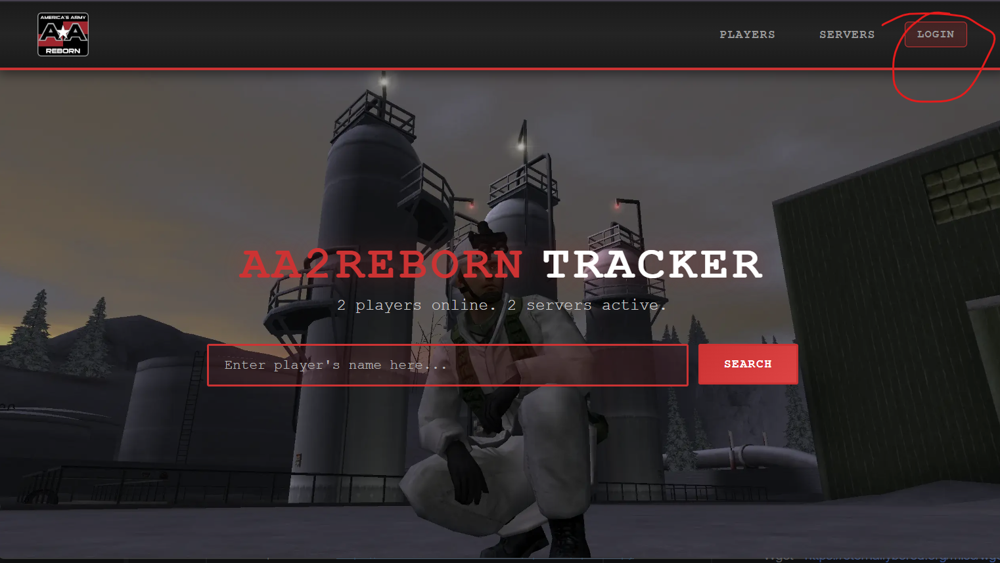
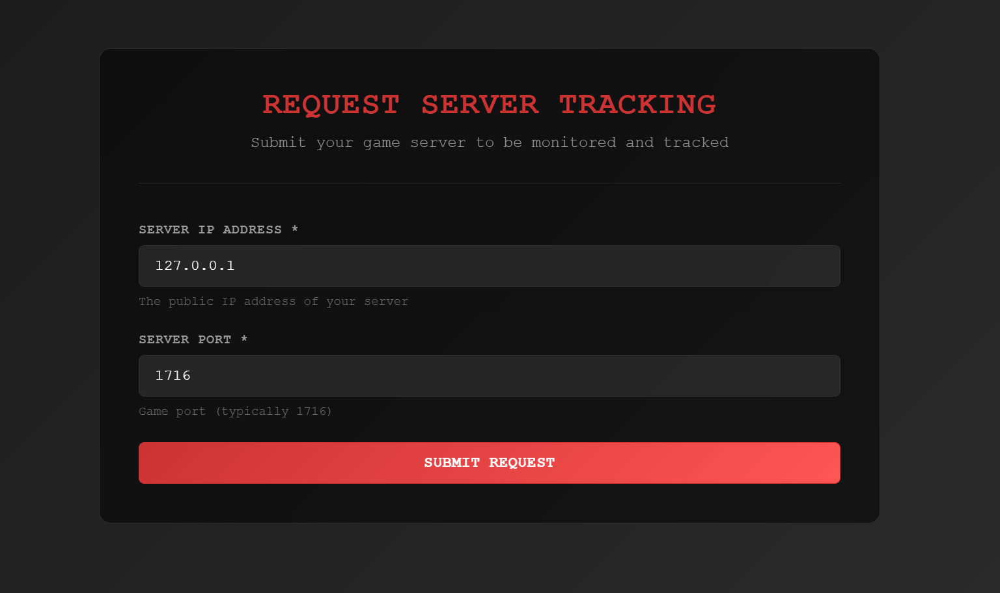

# Dedicated Servers — AA2Reborn

## Overview

This document explains how to run a dedicated server for AA2Reborn on:

- [Windows](#windows-—-quick-start)
- [Linux using Wine](#linux-wine-—-quick-start)

The steps cover prerequisites, installation, configuration, running the server, firewall and ports guidance, and troubleshooting tips.

## Important Notes
- If you don't have experience running America's Army 2 servers, I highly recommend reading this guide first from top to bottom, then follow the instructions to set up your server on your desired OS.
- The port you specify in server.ini is the game port. You must keep in mind that the query port is game port + 1, so if you specify 1716 in server.ini, you have to open 1716 and 1717 in your firewall and port forward them if you're behind a router.
## Register on tracker.aa2reborn.com
Before you can run a server, you need to register on https://tracker.aa2reborn.com and create a server. Please input the server IP and port you're willing to use.


Press on REQUEST TRACKING at the top, then fill in your server data.



## Windows — Quick start

### Prerequisites

- A Windows server or desktop (Windows 10/11, Server 2016/2019/2022)
- Administrator access firewall and router to open ports
- Python 3 - https://www.python.org/downloads/
- Wget - https://eternallybored.org/misc/wget/ (or use PowerShell's Invoke-WebRequest)

### Install and prepare

Create a folder for the server

```powershell
mkdir aaserver
cd aaserver
```

Grab the updater from https://download.aa2reborn.com/updates/updater.py

```powershell
wget https://download.aa2reborn.com/updates/updater.py -O updater.py
```

Run the following commands to get the prerequisites for the updater

```powershell
pip install -r https://download.aa2reborn.com/updates/updater_requirements.txt
```

Run the updater:

```powershell
python updater.py
```

Then you can run RunServer.bat, all args are optional.

```powershell
RunServer.bat -log=<filename> -ini=<filename> -ultimatemod=false
```

You have the following options for the server bat. You have the option to use Ultimate Mod, an useful mod for
server administration. It is enabled by default.

| Argument                 | Description                                    | Default    |
|--------------------------|------------------------------------------------|------------|
| ```-log=<filename>```    | Sets the log output file.                      | server.log |
| ``` -ini=<filename>```   | Sets the initialization file.                  | server.ini |
| ```-ultimatemod=false``` | Disables the Ultimate Mod flag for AAMods.exe. | true       |

[!!! IMPORTANT !!!] Jump to the [server.ini configuration](#serverini-configuration) section below for the configuring
the server.

### Running multiple servers

If you want to run multiple servers on the same machine, you can just create another server.ini and keep the same
game folder.

```powershell
RunServer.bat -log=server2.log -ini=server2.ini
```

### Firewall and ports

- Open the game port and query port configured for the server in `server.ini` or via the command-line `-port` argument.

PowerShell example:

```powershell
New-NetFirewallRule -DisplayName "AA2Reborn Server Game Port" -Direction Inbound -Protocol UDP -LocalPort 1716 -Action Allow
New-NetFirewallRule -DisplayName "AA2Reborn Server Query Port" -Direction Inbound -Protocol UDP -LocalPort 1717 -Action Allow
```

### Troubleshooting (Windows)

- Check server logs (Logs, Saved/Logs) for startup errors.
- Install missing Visual C++ redistributables if an MSVCR*.dll error appears.
- Run the executable from a console to view runtime output.

## Linux (Wine) — Quick start

Unfortunately, there's no native way to deploy a server natively on Linux because I cannot find the original server
binaries. This will do until we can figure out a solution natively for Linux.

### Prerequisites

- A Linux distribution (Debian/Ubuntu/CentOS/Alma/Rocky, etc.)
- Wine (32-bit or multiarch)
- Python 3
- Dedicated user account for the server (recommended)

### Install Wine and winetricks (Debian/Ubuntu example)

```bash
sudo apt update; sudo apt install -y wine64 wine32 wget python3
```

### Install and prepare

Create a folder for the server

```powershell
mkdir aaserver
cd aaserver
```

Grab the updater from https://download.aa2reborn.com/updates/updater.py

```powershell
wget https://download.aa2reborn.com/updates/updater.py -O updater.py
```

Run the following commands to get the prerequisites for the updater

```powershell
pip install -r https://download.aa2reborn.com/updates/updater_requirements.txt
```

Run the updater:

```powershell
python3 updater.py
```

### Run the server

```bash
chmod +x RunServer.sh
./RunServer.sh
```

I like to use screen to keep the server running in the background.

```bash
screen -dmS aareborn ./RunServer.sh
```

Then write this command to attach to the screen session and see the server output:

```bash
screen -r aareborn
```

Ctrl + A, then D to detach from the screen session and keep it running in the background.

### Firewall and ports (Linux)

- Open the game port and query port used by the server on the host firewall and any cloud provider security groups.

ufw example:

```bash
sudo ufw allow 1716/udp
sudo ufw allow 1717/tcp
```

## server.ini configuration

It's very important that you properly configure the server.ini file. Open the server.ini and look for the
```[AA2Reborn_Auth.AA_ServerConfig]``` section

```
[AA2Reborn_Auth.AA_ServerConfig]
AuthServerAddress=auth.aa2reborn.com
AuthServerPort=80
ServerSecret=<your-server-secret-here>
ExternalIP=<your-external-ip-here>
Port=<your-server-port-here>
```

For ExternalIP, you can use a service like https://ipinfo.io/ip to find your public IP address.

For Linux:

```
curl https://ipinfo.io/ip
```

For the ServerSecret, go to https://tracker.aa2reborn.com, login with your AA2Reborn account, press on your username on
the header to go to Profile and create a new server to get a secret key.

For the Port, you can choose any port you want, I'd recommend the default one: 1716. The query port is game port + 1, so
in our case 1717, keep in mind you have to port forward it too.

Look for the ```URL``` section at the top of server.ini and modify the game port as well with your port from
AA_ServerConfig

```
Port=1716
```

## Performance and security

- Run under a dedicated non-privileged user account.
- Ensure the host has sufficient CPU, RAM, and network bandwidth.

## Backups and updates

- Backup config files and any persistent data regularly.

## Appendix — Useful commands

PowerShell: check listening ports

```powershell
Get-NetTCPConnection -LocalPort 12345 -State Listen
Get-NetUDPEndpoint | Where-Object LocalPort -EQ 12345
```

Linux: check listening ports

```bash
sudo ss -tunlp | grep -E "12345|AA_Server"
```
