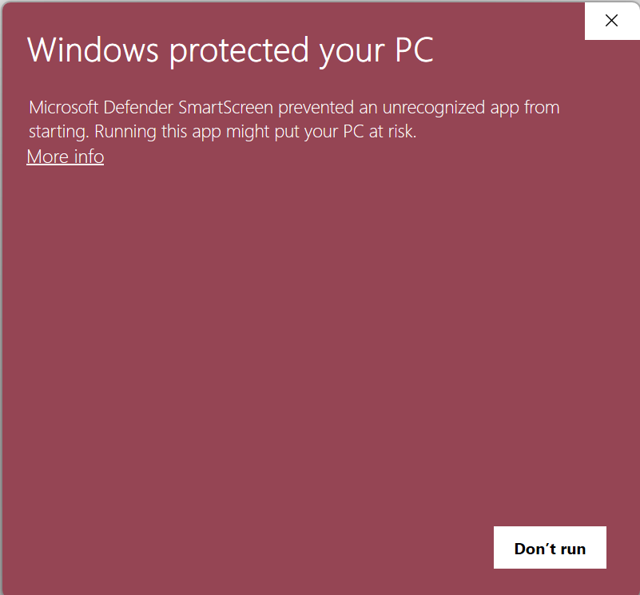

# Game installation

The installation for AA2Reborn is pretty straightforward.

## Windows

Download the game from [here](https://download.aa2reborn.com/AA2Reborn_0.3.0_x64-setup.exe) and follow the instructions.

### Smartscreen

You might get the following warning from Windows Smartscreen when you try to run the installer. This is because the installer is not signed with a code signing certificate, which is a common practice for community projects to avoid the cost of obtaining a certificate. **The file is totally safe.**



 Press more info and then click on "Run anyway" to proceed with the installation.


## Linux

Make sure you have Wine installed on your system as America's Army 2.8.5 is not natively supported on Linux. You can install it using your distribution's package manager. For example, on Ubuntu, you can run the following command:

```bash
sudo apt-get install wine
```
Once you have Wine installed, you can download the AppImage from [here](https://download.aa2reborn.com/AA2Reborn_0.3.0_amd64.AppImage).

Then do:
```bash
chmod +x AA2Reborn_0.3.0_amd64.AppImage
./AA2Reborn_0.3.0_amd64.AppImage
```